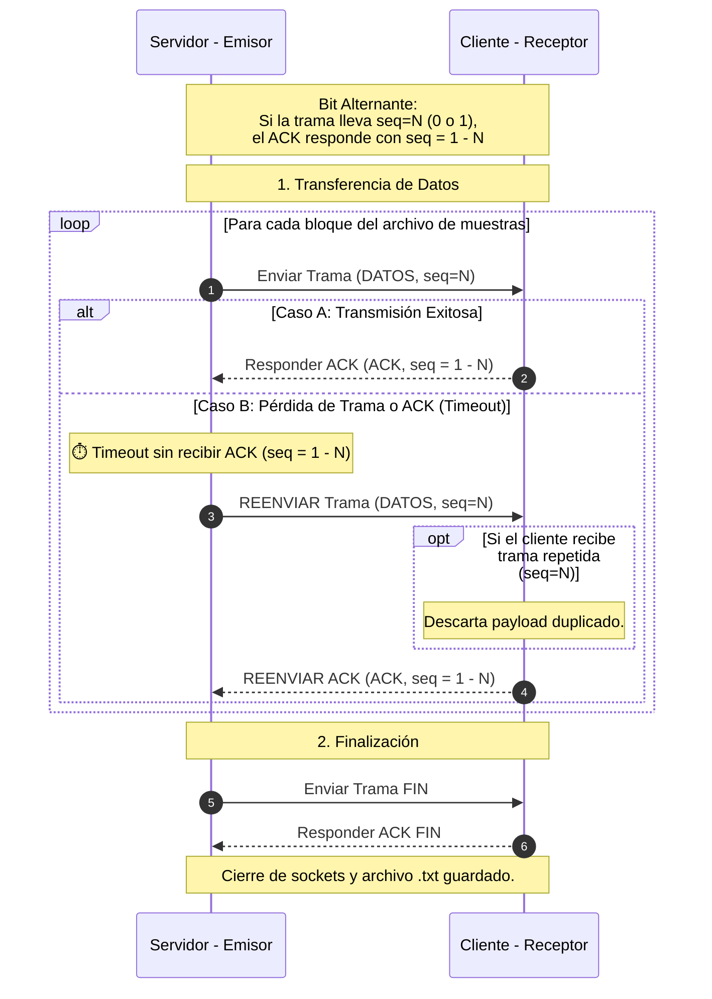
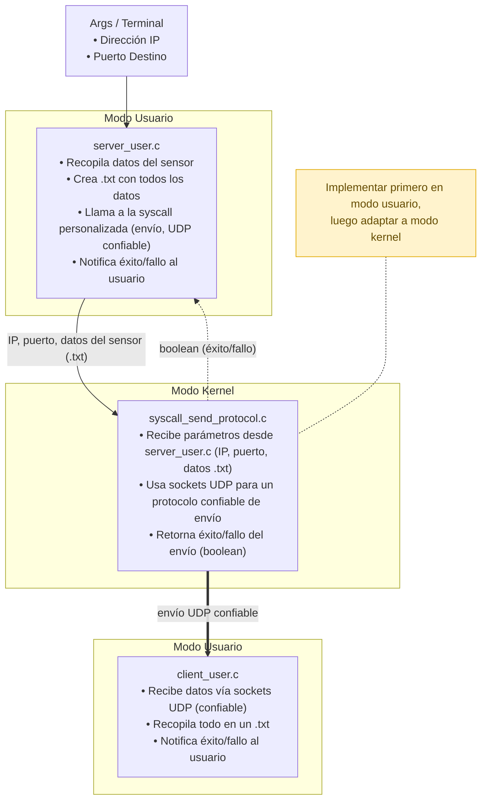

# División del trabajo Etapa 1

| Proceso                 | Estudiante asignado                        |
| ----------------------- | ------------------------------------------ |
| server_user.c           | Daniel Rodríguez                           |
| syscall_send_protocol.c | José Serrano, Marina Castro y Hermes Rojas |
| client_user.c           | Sebastián Sánchez                          |

## Tareas de cada estudiante

### server_user.c

- [x] Capturar datos del sensor en la Raspberry Pi y generar el archivo `.txt` local.
- [x] Implementar la interfaz/llamada hacia `syscall_send_protocol` pasando IP, puerto y ruta del `.txt`.
- [x] Notificar éxito o fallo del envío al usuario.

### syscall_send_protocol.c

- [x] Crear socket UDP y lectura del archivo `.txt` en bloques (`fread`).
- [x] Construir tramas inyectando la Header de 4 bytes y enviar con `sendto()`.
- [x] Configurar el temporizador de retransmisión (`SO_RCVTIMEO`) para manejar el timeout.
- [x] Recibir ACK con `recvfrom()`, validar el bit alternante (1 - N) y enviar trama FIN al terminar.

### client_user.c

- [x] Crear socket UDP y enlazar el puerto destino con `bind()`.
- [x] Bucle de recepción con `recvfrom()`, extracción de Header y filtrado de tramas duplicadas.
- [x] Generar y responder el ACK con el bit conmutado (1 - N).
- [x] Escribir los datos recibidos en el archivo `.txt` local, procesar trama FIN y notificar al usuario.

### Tareas en Conjunto  

- [x] Crear `include/protocol.h` con la `struct Header` de N bytes y armar el `Makefile` del proyecto.

## Diagrama de Secuencia del Protocolo

## Diagrama de Arquitectura

