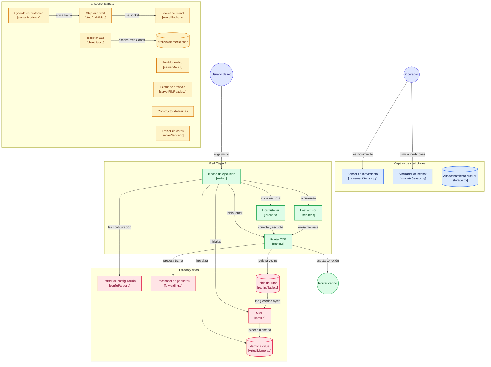

# División del trabajo Etapa 2

| Módulo                                     | Estudiante |
| ------------------------------------------ | ---------- |
| Configuración, Precarga y Build System     | Hermes     |
| Protocolo y Serialización                  | Sebas      |
| Motor de Red con pthread                   | Jose       |
| Conmutación y Propagación (Lógica Central) | Marina     |
| Nodos Host y CLI                           | Daniel     |

# Diagrama de flujo 

