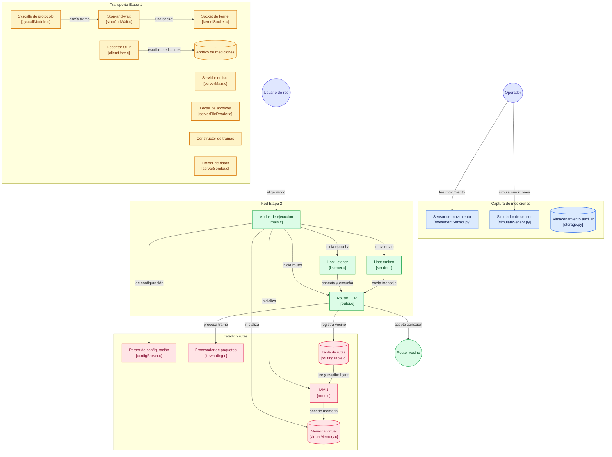

# División del trabajo Etapa 2

| Módulo                                     | Estudiante |
| ------------------------------------------ | ---------- |
| Configuración, Precarga y Build System     | Hermes     |
| Protocolo y Serialización                  | Sebas      |
| Motor de Red con pthread                   | Jose       |
| Conmutación y Propagación (Lógica Central) | Marina     |
| Nodos Host y CLI                           | Daniel     |

## Tareas de cada estudiante

### Tareas en Conjunto  

- [x] Probar todo el sistema de extremo a extremo.
- [x] **Depuración de concurrencia:** Correr las pruebas usando AddressSanitizer y ThreadSanitizer para asegurar que no existan fugas de memoria ni *race conditions* en la MMU.
- [x] La MMU usa un uint32_t. No se van a usar strings como "eth0". Se va a guardar y buscar directamente el File Descriptor del socket abierto (como si fuera la interfaz).

### Persona 1: Configuración, Precarga y Build System

**Archivos:** configParser.c, Makefile y pruebas.

- [x] Configuración: Programar la lectura de config.txt para extraer la IP local y los vecinos.
- [x] Precarga: Hacer los llamados iniciales a saveRoute() para cargar las conexiones directas en la memoria virtual antes de levantar la red.
- [x] Compilación: Crear el Makefile centralizado definiendo las reglas para compilar todos los .c con la bandera -pthread.
- [x] Testing: Hacer un main de pruebas para probar la MMU de 256 bytes y asegurar que no haya desbordamientos.

---

### Persona 2: Protocolo y Serialización

**Archivos:** protocol.c, protocol.h

- [x] Decodificación: Programar decodeFrame(), asegurando limpiar caracteres residuales o saltos de línea (\n, \r, \0) del buffer del socket para no rechazar tramas válidas.
- [x] Codificación: Añadir la firma en el .h e implementar encodeFrame() para transformar el struct en el string exacto TIPO|IP|DATOS\n.
- [x] Conversión: Utilizar solamnte inet_pton e inet_ntop para manejar las IPs en binario de red (evitar htonl/ntohl).

---

### Persona 3: Motor de Red con pthread

**Archivos:** router.c, router.h

- [x] Arranque: Programar initRouterListen() configurando el socket (bind, listen) y lanzando el hilo con pthread_create.
- [x] Bucle Pasivo: Programar la rutina del hilo listening() usando recv(). No toma decisiones lógicas: su única función es recibir bytes y pasar el buffer crudo y el sockfd a la función de enrutamiento (De persona 4).
- [x] Apagado: Programar endRouterListen() para cerrar los descriptores de archivo y matar el hilo limpiamente.

### Persona 4: Conmutación y Propagación (Lógica Central)

**Archivos:** forwarding.c, forwarding.h

- [x] Protección de Memoria: Declarar e inicializar un pthread_mutex_t. Es obligatorio bloquear y liberar el mutex justo antes y después de cada llamada a saveRoute o findRoute para no corromper la MMU.
- [x] Anuncios (Generación): Programar la emisión de un mensaje ANNOUNCE propio por los sockets activos apenas el router encienda.
- [x] Propagación: En la función principal processPacket(buffer, sockfd): si recibe ANNOUNCE o ADVERTISE, guardarlo con saveRoute(). Si la ruta resulta ser nueva, generar un ADVERTISE y reenviarlo a los demás routers vecinos.
- [x] Conmutación: Si el paquete recibido es DATA, buscar el destino con findRoute() y reenviarlo hacia ese FD usando send().

### Persona 5: Nodos Host y CLI

**Archivos:** listener.c, sender.c, main.c, listener.h, sender.h

- [x] Receptor: Programar keepListening() configurando el socket cliente pasivo, y showMessage() para imprimir datos en terminal.
- [x] Emisor: Programar sendMessage() para que el cliente empaquete y mande datos al router.
- [x] CLI (Interfaz de comandos): Programar main.c con el manejo de argumentos (argc/argv) para que el usuario decida si el ejecutable arranca en modo router, emisor o receptor.

# Diagrama de flujo de archivos y datos



# Comandos para la ejecución del programa

> Ubicarse dentro de la carpeta Etapa2/

### Compilación

``` bash

# Compilación para todo el proyecto
make

```

### Ejecución

Es recomendado que para esta sección se abran múltiples ventanas de línea de comandos (terminal) o estén activas distintas computadoras para observar el envío y recepción de datos entre distintos dispositivos para así asegurar el flujo intencionado en esta etapa.

#### Conocimiento de la dirección IP del dispositivo actual

``` bash

# Obtiene la IP local
hostname -I

```

*La obtención de la IP local es un paso crucial para la ejecución de este sistema de routers, receptores y emisores. Es necesaria para que el router funcione correctamente para el posterior envío (--send) y recibo (--listen) de datos.*

#### Router

``` bash

# Ejecución para el arranque de router
./build/routing --router config.txt

```

*El archivo (Argumento 3) dado es el que contiene la información base de puerto, IP, hosts locales directos y routers vecinos del router propio.*

#### Computadora receptora

``` bash

# Ejecución para el arranque del dispositivo receptor
./build/routing --listen <IP de la computadora> 8080 <IP Host>

```

***1. Argumento 3 (IP de la computadora):*** *Es la dirección IP de la computadora (obtenida con ***hostname -I***) en donde el router se encuentra ejecutándose.*  

***2. Argumento 5 (IP Host):*** *Debe ser la misma que uno de los hosts locales directos (especificados en el archivo config.txt) del router.*

#### Computadora emisora

``` bash

# 1. Envío de datos local (envía a un host directo del router)
# Ejecución para el arranque del dispositivo emisor
./build/routing --send <IP real del router> 8080 <IP Host> "Prueba local"

# 2. Envío de datos externo (envía a un host externo al router)
# Ejecución para el arranque del dispositivo emisor
./build/routing --send <IP real del router> 8080 <IP Externa> "Hola Grupo Y"

```

*1. ***El argumento 3 (IP propia)*** coresponde a la dirección IP del dispositivo actual. En caso de que el router se ubique en la misma máquina donde se hace el --send se utiliza la IP **127.0.0.1**, en caso contrario sería la IP real (la obtenida con hostname -I).*  

*2. ***El argumento 5 (IP Host / Externa)*** corresponde al dispositivo destinatario.*

### Limpieza y borrado de archivos

``` bash

# Limpieza y borrado para todo el proyecto
make clean

```