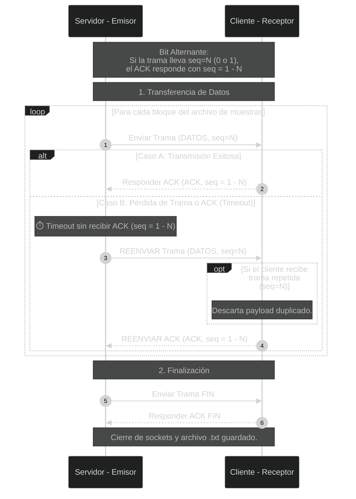

# CI-0123 - Proyecto Integrador Redes-Oper

**Universidad de Costa Rica**
Facultad de Ingeniería - Escuela de Ciencias de la Computación e Informática

II Semestre, 2026

---

## Equipo Koopa Troopas

| Estudiante                    | Carné  |
| ----------------------------- | ------ |
| Daniel Rodríguez Ruiz         | C4J199 |
| Hermes Josué Rojas Sancho     | C16882 |
| José Andrés Serrano Chavarría | C4J967 |
| Marina Castro Peralta         | C31886 |
| Sebastián Sánchez Jiménez     | C4J761 |

## Profesores

- Maeva Murcia Meléndez
- Adrián Lara Petitdemange

---

## Sobre el repositorio

Este repositorio contiene el desarrollo completo del Proyecto Integrador del curso
CI-0123 (Redes y Sistemas Operativos) a lo largo del II Semestre 2026, incluyendo
documentación, diseño e implementación de cada etapa.

## Etapas

| Etapa | Descripción                            | Estado      |
| ----- | -------------------------------------- | ----------- |
| 1     | Propuesta de protocolo de comunicación | En progreso |

## División del trabajo Etapa 1

| Proceso       	 			| Estudiante asignado  |
| ----------------------------- | ------ |
| server_user.c    				| Daniel Rodríguez |
| syscall_send_protocol.c   	| José Serrano, Marina Castro y Hermes Rojas |
| client_user.c 				| Sebastián Sánchez |

## Diagrama de Secuencia del Protocolo

## Cómo ejecutar

_Pendiente: instrucciones de build y ejecución._
